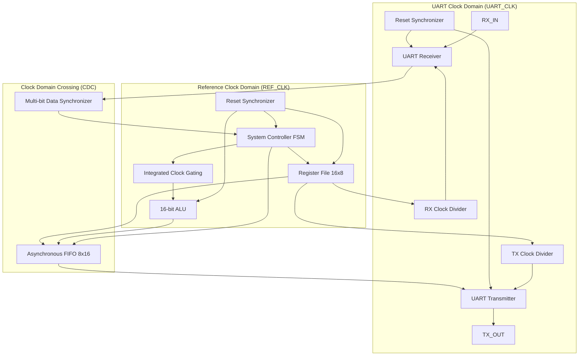

# Multi-Clock Domain Digital System & ASIC Implementation Flow

[](file:///C:/Users/Ahamed/Desktop/Digital_Design_Dipolma_Assignments/Final_System/rtl)
[](file:///C:/Users/Ahamed/Desktop/Digital_Design_Dipolma_Assignments/Final_System/IC/Projects/System/std_cells)
[](file:///C:/Users/Ahamed/Desktop/Digital_Design_Dipolma_Assignments/Final_System/IC/Projects/System/Synthesis)
[](file:///C:/Users/Ahamed/Desktop/Digital_Design_Dipolma_Assignments/Final_System/IC/Projects/System/DFT)
[](file:///C:/Users/Ahamed/Desktop/Digital_Design_Dipolma_Assignments/Final_System/IC/Projects/System/Formality)

A complete, production-grade ASIC design and verification project featuring a configurable multi-clock domain digital system. The design integrates a full-duplex UART interface, dual clock domain synchronization, an Asynchronous FIFO, configurable clock dividers, an integrated clock gating latch, a centralized register file, and an arithmetic logic unit (ALU).

The backend flow is fully implemented and verified using Synopsys EDA tools under the TSMC 130nm standard-cell CMOS technology library.

---

## Architecture Overview



---

## Key Hardware Modules

1. **System Controller ([`SYS_CTRL.v`](file:///C:/Users/Ahamed/Desktop/Digital_Design_Dipolma_Assignments/Final_System/rtl/SYS_CTRL.v))**:
   - Master command interpreter supporting RF Write, RF Read, ALU Operation with Operand, and ALU Operation without Operand.
2. **UART Subsystem ([`UART.v`](file:///C:/Users/Ahamed/Desktop/Digital_Design_Dipolma_Assignments/Final_System/rtl/UART.v))**:
   - **Receiver ([`UART_RX.v`](file:///C:/Users/Ahamed/Desktop/Digital_Design_Dipolma_Assignments/Final_System/rtl/UART_RX.v))**: 3-sample majority voting filter, start/stop bit checkers, parity checker, and deserializer.
   - **Transmitter ([`UART_TX.v`](file:///C:/Users/Ahamed/Desktop/Digital_Design_Dipolma_Assignments/Final_System/rtl/UART_TX.v), [`FSM_TX.sv`](file:///C:/Users/Ahamed/Desktop/Digital_Design_Dipolma_Assignments/Final_System/rtl/FSM_TX.sv))**: Serializer with parity generator and output multiplexing.
3. **Clock Generation & Gating**:
   - **Clock Dividers ([`Clk_Div.v`](file:///C:/Users/Ahamed/Desktop/Digital_Design_Dipolma_Assignments/Final_System/rtl/Clk_Div.v))**: Independent integer division for TX and RX baud generators with prescaling ([`prescale_mux.v`](file:///C:/Users/Ahamed/Desktop/Digital_Design_Dipolma_Assignments/Final_System/rtl/prescale_mux.v)).
   - **Clock Gating ([`CLK_GATE.v`](file:///C:/Users/Ahamed/Desktop/Digital_Design_Dipolma_Assignments/Final_System/rtl/CLK_GATE.v))**: Low-power clock gate activating the ALU clock only during computations.
4. **Clock Domain Crossing & Synchronizers**:
   - **Asynchronous FIFO ([`ASYNC_FIFO.v`](file:///C:/Users/Ahamed/Desktop/Digital_Design_Dipolma_Assignments/Final_System/rtl/ASYNC_FIFO.v))**: Dual-clock FIFO with Gray code pointer conversion and 2-stage synchronizers ([`DF_SYNC.v`](file:///C:/Users/Ahamed/Desktop/Digital_Design_Dipolma_Assignments/Final_System/rtl/DF_SYNC.v)).
   - **Reset Synchronizers ([`RST_SYNC.v`](file:///C:/Users/Ahamed/Desktop/Digital_Design_Dipolma_Assignments/Final_System/rtl/RST_SYNC.v))**: Asynchronous assert, synchronous deassert resets for each clock domain.
   - **Data Synchronizer ([`DATA_SYNC.v`](file:///C:/Users/Ahamed/Desktop/Digital_Design_Dipolma_Assignments/Final_System/rtl/DATA_SYNC.v))**: Multi-bit handshaking synchronizer with pulse generation ([`Pulse_Gen.v`](file:///C:/Users/Ahamed/Desktop/Digital_Design_Dipolma_Assignments/Final_System/rtl/Pulse_Gen.v)).
5. **Arithmetic Logic Unit ([`ALU.v`](file:///C:/Users/Ahamed/Desktop/Digital_Design_Dipolma_Assignments/Final_System/rtl/ALU.v))**:
   - 16-bit output supporting addition, subtraction, multiplication, division, logic AND/OR/NAND/NOR/XOR/XNOR, and shift operations.
6. **Register File ([`regfile.v`](file:///C:/Users/Ahamed/Desktop/Digital_Design_Dipolma_Assignments/Final_System/rtl/regfile.v))**:
   - 16 addressable 8-bit registers (REG0-REG15) storing operands, ALU results, UART prescalers, and division ratios.

---

## Directory Organization

```
Final_System/
│
├── docs/                               # System specifications and waveforms
│   ├── Final_System.pdf                # Full architectural specifications
│   └── simulation_waveform.pdf         # ModelSim simulation waveforms
│
├── rtl/                                # Golden Synthesizable RTL source files (29 modules)
│   ├── ALU.v
│   ├── ASYNC_FIFO.v
│   ├── Clk_Div.v
│   ├── CLK_GATE.v                      # Simulation & ASIC synthesis enabled
│   ├── DATA_SYNC.v
│   ├── DF_SYNC.v
│   ├── FIFO_MEM_CNTRL.v
│   ├── FIFO_RD.v
│   ├── FIFO_WR.v
│   ├── FSM_RX.v
│   ├── FSM_TX.sv
│   ├── MUX.v
│   ├── Parity_Calc.v
│   ├── Pulse_Gen.v
│   ├── RST_SYNC.v
│   ├── SYS_CTRL.v
│   ├── SYSTEM_TOP.v                    # Top-level functional module
│   ├── Serializer.v
│   ├── UART.v
│   ├── UART_RX.v
│   ├── UART_TX.v
│   ├── data_sampling.v
│   ├── deserializer.v
│   ├── edge_bit_counter.v
│   ├── parity_checker.v
│   ├── prescale_mux.v
│   ├── regfile.v
│   ├── stop_checker.v
│   └── strt_checker.v
│
├── tb/                                 # Verification testbenches
│   └── SYSTEM_TOP_tb.v                 # Comprehensive top-level testbench
│
├── sim/                                # Simulation scripts & environment
│   └── run.do                          # QuestaSim / ModelSim compilation & run script
│
├── IC/                                 # ASIC Implementation Flow (VM Environment)
│   └── Projects/
│       └── System/
│           ├── std_cells/              # TSMC 130nm library (.db and .lib files)
│           ├── lint/                   # SpyGlass Lint project, rules & waivers
│           ├── CDC/                    # SpyGlass CDC analysis, SDC & SGDC constraints
│           ├── Synthesis/              # Synopsys DC scripts, constraints, reports, netlists
│           ├── DFT/                    # Synopsys DFT scan insertion, scan netlists & reports
│           └── Formality/              # Formal Equivalence Verification (post-syn, post-dft, post-pnr)
│
├── .gitignore                          # EDA & simulation cache filter
└── README.md                           # Project documentation
```

---

## Simulation & Verification

The testbench tests all operations including Register File read/write, ALU computations across different modes, UART packet transmissions with parity/framing error tests, and asynchronous FIFO transfers.

### Running with ModelSim / QuestaSim:
1. Open ModelSim/QuestaSim.
2. Change directory to `sim/`:
   ```tcl
   cd sim
   ```
3. Execute the simulation DO script:
   ```tcl
   do run.do
   ```

---

## ASIC Backend Implementation Results

The ASIC backend was implemented using the **TSMC 130nm CMOS** library under worst-case operating conditions (`scmetro_tsmc_cl013g_rvt_ss_1p08v_125c`, 1.08V, 125°C).

### 1. Synthesis Summary (Synopsys Design Compiler)
* **Target Clock Frequency**: 100 MHz (Clock Period = 10.0 ns)
* **Setup Timing Slack**: **0.00 ns (MET - Zero Slack Closure)**
* **Hold Timing Slack**: **0.04 ns (MET)**
* **Total Cell Area**: `27,225.31 µm²`
* **Total Area (including net interconnect)**: `301,113.36 µm²`
* **Cell Count**: 2,275 cells (1,844 combinational, 393 sequential)
* **Dynamic Power**: `13.56 mW` | **Cell Leakage Power**: `704.9 nW`

### 2. Design for Testability (DFT Compiler)
* **Scan Chains**: **4 Chains**
* **Scan Cells**: 389 flip-flops stitched
* **Test Coverage**: **99.66%**
* **Fault Coverage**: **99.27%**
* **Total Faults**: 17,638 faults evaluated

### 3. Formal Verification (Synopsys Formality)
* **RTL vs. Post-Synthesis Netlist**: **100% Equivalence Verification SUCCEEDED** (55,620 compare points verified, 0 failing, 0 unverified).
* **Post-Synthesis vs. Post-DFT Netlist**: **100% Equivalence Verification SUCCEEDED** (53,410 compare points verified, 0 failing, 0 unverified).

---

## Uploading to GitHub

To push this project to your GitHub repository under your designated university email (`ahmed.badwy05@eng-st.cu.edu.eg`):

```bash
# 1. Initialize git inside this folder
git init

# 2. Configure your identity specifically for this repository
git config user.name "Ahmed Badawy"
git config user.email "ahmed.badwy05@eng-st.cu.edu.eg"

# 3. Add your remote repository URL
git remote add origin https://github.com/ahmedbadwy77/Low-Power-Multi-Clock-Digital-Communication-System.git

# 4. Stage and commit all files
git add .
git commit -m "Initial commit: Complete digital system design and TSMC 130nm ASIC backend flow"

# 5. Push to GitHub
git branch -M main
git push -u origin main
```
