# Low-Power Multi-Clock Digital Communication System & ASIC Implementation Flow

[](https://github.com/ahmedbadwy77/Low-Power-Multi-Clock-Digital-Communication-System/actions/workflows/ci.yml)
[](rtl/)
[](IC/Projects/System/std_cells/)
[](IC/Projects/System/Synthesis/)
[](IC/Projects/System/DFT/)
[](IC/Projects/System/Formality/)
[](LICENSE)

An industrial-grade, multi-clock domain System-on-Chip (SoC) communication subsystem designed in synthesizable **Verilog / SystemVerilog** and verified through a complete **ASIC backend flow** using Synopsys and SpyGlass EDA tools under the **TSMC 130nm CMOS** technology library.

The system features full-duplex configurable **UART communication**, **dual-clock asynchronous synchronization**, a 16-word dual-clock **Asynchronous FIFO**, dynamic **clock dividers**, an **Integrated Clock Gating (ICG)** cell for ultra-low dynamic power, a 16-register **Register File**, and a high-performance 16-bit **Arithmetic Logic Unit (ALU)**.

---

## Table of Contents
- [1. System Architecture Overview](#1-system-architecture-overview)
- [2. Top-Level Ports & Interface](#2-top-level-ports--interface)
- [3. Communication Protocol & Frame Formats](#3-communication-protocol--frame-formats)
- [4. Detailed Hardware Module Descriptions](#4-detailed-hardware-module-descriptions)
  - [4.1 System Controller (SYS_CTRL)](#41-system-controller-sys_ctrl)
  - [4.2 Register File (regfile)](#42-register-file-regfile)
  - [4.3 Arithmetic Logic Unit (ALU)](#43-arithmetic-logic-unit-alu)
  - [4.4 Integrated Clock Gating (CLK_GATE)](#44-integrated-clock-gating-clk_gate)
  - [4.5 UART Transmitter (UART_TX)](#45-uart-transmitter-uart_tx)
  - [4.6 UART Receiver (UART_RX)](#46-uart-receiver-uart_rx)
  - [4.7 Asynchronous FIFO (ASYNC_FIFO)](#47-asynchronous-fifo-async_fifo)
  - [4.8 Multi-Bit Data Synchronizer (DATA_SYNC)](#48-multi-bit-data-synchronizer-data_sync)
  - [4.9 Reset Synchronizer (RST_SYNC)](#49-reset-synchronizer-rst_sync)
  - [4.10 Clock Dividers & Prescaler MUX](#410-clock-dividers--prescaler-mux)
  - [4.11 Pulse Generator (Pulse_Gen)](#411-pulse-generator-pulse_gen)
- [5. Verification & Waveforms](#5-verification--waveforms)
- [6. ASIC Implementation Flow & Results](#6-asic-implementation-flow--results)
  - [6.1 Logic Synthesis (Synopsys DC)](#61-logic-synthesis-synopsys-dc)
  - [6.2 Design for Testability (DFT Compiler)](#62-design-for-testability-dft-compiler)
  - [6.3 Formal Verification (Synopsys Formality)](#63-formal-verification-synopsys-formality)
  - [6.4 Lint & CDC Sign-off (SpyGlass)](#64-lint--cdc-sign-off-spyglass)
- [7. Directory Structure](#7-directory-structure)
- [8. How to Run Simulation & Verification](#8-how-to-run-simulation--verification)

---

## 1. System Architecture Overview

The system operates across **two distinct asynchronous clock domains** connected through robust Clock Domain Crossing (CDC) synchronization structures:
1. **Reference Clock Domain (`REF_CLK` @ 50 MHz)**: High-speed processing domain hosting the master System Controller FSM, the Register File, the Integrated Clock Gating latch, and the 16-bit ALU.
2. **UART Clock Domain (`UART_CLK` @ 3.6864 MHz)**: Low-speed serial communication domain hosting the UART transmitter, UART receiver, clock division logic, and FIFO pop-pulse generation.

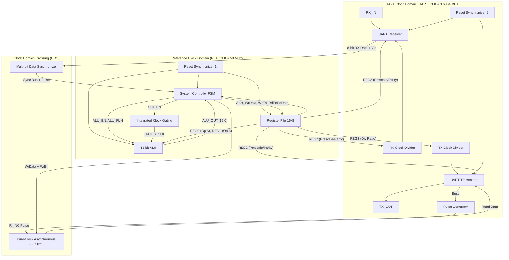

---

## 2. Top-Level Ports & Interface

| Port Name | Direction | Width | Clock Domain | Description |
| :--- | :---: | :---: | :---: | :--- |
| `REF_CLK` | Input | 1-bit | REF_CLK | Reference high-speed system clock (50 MHz) |
| `UART_CLK` | Input | 1-bit | UART_CLK | Asynchronous UART baud generation clock (3.6864 MHz) |
| `RST` | Input | 1-bit | Asynchronous | Master active-low asynchronous reset |
| `RX_IN` | Input | 1-bit | UART_CLK | Serial UART input stream |
| `TX_OUT` | Output | 1-bit | UART_CLK | Serial UART output stream |
| `parity_error` | Output | 1-bit | UART_CLK | Asserted high when a received frame parity check fails |
| `framing_error`| Output | 1-bit | UART_CLK | Asserted high when a received frame stop bit is invalid |

---

## 3. Communication Protocol & Frame Formats

### 3.1 UART Frame Structure
Every UART communication frame transmitted or received consists of 10 or 11 serial bits:
* **Start Bit**: 1-bit logic `0`.
* **Data Bits**: 8-bit payload transmitted **LSB first**.
* **Parity Bit (Optional)**: 1-bit parity (Even or Odd), dynamically configured via `REG2[0]` (Enable) and `REG2[1]` (Type).
* **Stop Bit**: 1-bit logic `1`.

```
Idle (1) ──┐        ┌──────┬──────┬──────┬──────┬──────┬──────┬──────┬──────┐ ┌────────┐ ┌─── Idle (1)
           └────────┴──────┴──────┴──────┴──────┴──────┴──────┴──────┴──────┴─┴────────┴─┘
            Start    Bit 0  Bit 1  Bit 2  Bit 3  Bit 4  Bit 5  Bit 6  Bit 7   Parity   Stop
             (0)     (LSB)                                            (MSB)  (Opt)    (1)
```

### 3.2 Baud Rate & Oversampling Calculation
The serial communication baud rate is determined by dividing `UART_CLK`:

$$\text{TX Baud Rate} = \frac{f_{\text{UART-CLK}}}{\text{Div Ratio (REG3)}} = \frac{3.6864\text{ MHz}}{32} = 115,200\text{ Baud}$$

For the receiver, oversampling ensures robust data recovery in noisy environments:

$$\text{RX Sampling Clock} = \frac{f_{\text{UART-CLK}}}{\text{Prescale Mux Ratio}} = 115,200 \times \text{Prescale}$$

### 3.3 Master Command Protocol
The external host controls the system by sending multi-frame commands over UART:

#### Command 1: Register File Write (`0xAA`) — 3 Frames
Enables the host to write configuration parameters or data into any register.
```
Frame 0: [ 0xAA ] (RF Write Command ID)
Frame 1: [ Address (0x0 to 0xF) ]
Frame 2: [ Write Data (8-bit) ]
```

#### Command 2: Register File Read (`0xBB`) — 2 Frames
Reads data from an addressed register; the system returns 1 frame over `TX_OUT`.
```
Command:
Frame 0: [ 0xBB ] (RF Read Command ID)
Frame 1: [ Address (0x0 to 0xF) ]

System Response:
Frame 0: [ Read Data (8-bit) ]
```

#### Command 3: ALU Operation with Operands (`0xCC`) — 4 Frames
Updates operands in `REG0` and `REG1`, triggers the ALU, and transmits the 16-bit result back in 2 frames.
```
Command:
Frame 0: [ 0xCC ] (ALU with Operands Command ID)
Frame 1: [ Operand A (written to REG0) ]
Frame 2: [ Operand B (written to REG1) ]
Frame 3: [ ALU Function Code (ALU_FUN [3:0]) ]

System Response:
Frame 0: [ ALU_OUT[7:0]  (Least Significant Byte) ]
Frame 1: [ ALU_OUT[15:8] (Most Significant Byte)  ]
```

#### Command 4: ALU Operation with No Operands (`0xDD`) — 2 Frames
Executes an ALU function using the operands already stored in `REG0` and `REG1`.
```
Command:
Frame 0: [ 0xDD ] (ALU without Operands Command ID)
Frame 1: [ ALU Function Code (ALU_FUN [3:0]) ]

System Response:
Frame 0: [ ALU_OUT[7:0]  (Least Significant Byte) ]
Frame 1: [ ALU_OUT[15:8] (Most Significant Byte)  ]
```

---

## 4. Detailed Hardware Module Descriptions

### 4.1 System Controller (`SYS_CTRL`)
The **System Controller** is the master finite state machine (FSM) operating in the `REF_CLK` domain. It samples synchronized UART command frames, decodes opcodes, coordinates reads/writes to the Register File, asserts clock gating to the ALU, initiates ALU operations, and writes outgoing responses to the Asynchronous FIFO.

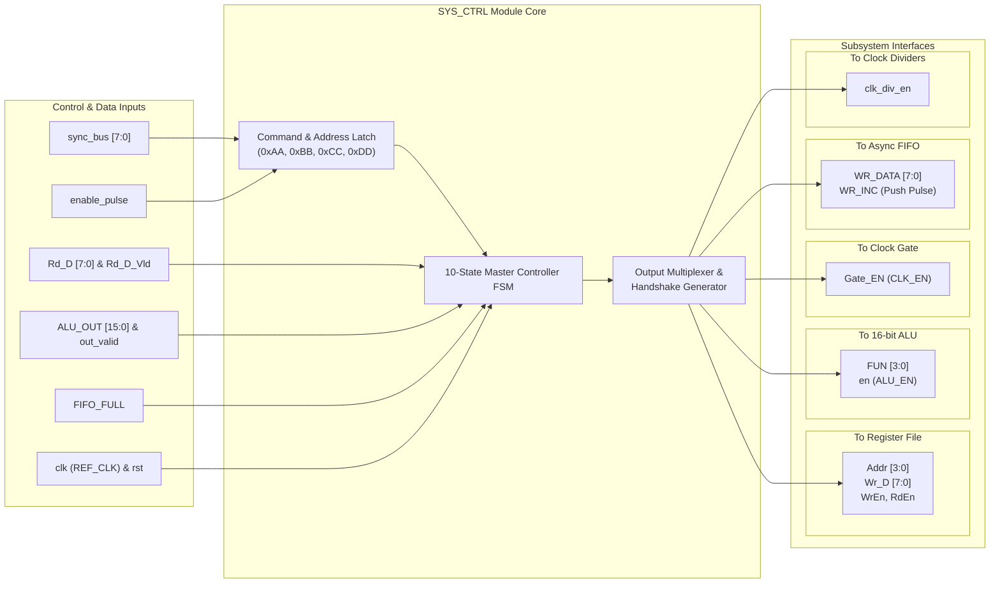

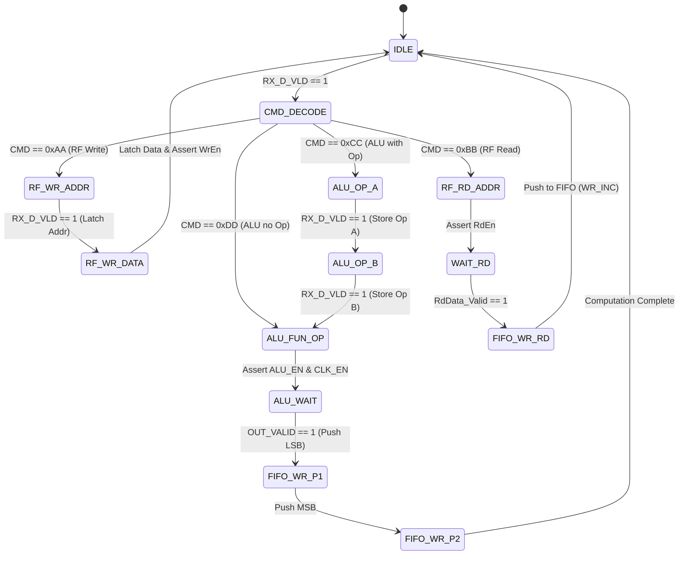

* **Key FSM States**: `IDLE`, `RF_ADDR`, `RF_WR_DATA`, `RF_RD_DATA`, `ALU_OP_A`, `ALU_OP_B`, `ALU_FUN_OP`, `ALU_WAIT`, `FIFO_WR_P1`, `FIFO_WR_P2`.
* **Handshake Coordination**: Automatically manages `WrEn`, `RdEn`, `CLK_EN`, `ALU_EN`, and `WR_INC` to ensure collision-free internal transfers.

---

### 4.2 Register File (`regfile`)
The **Register File** contains 16 addressable 8-bit registers (REG0 through REG15). Addresses `0x0` to `0x3` are reserved for system hardware configurations and direct operand feeds, while `0x4` to `0xF` are general-purpose storage registers.

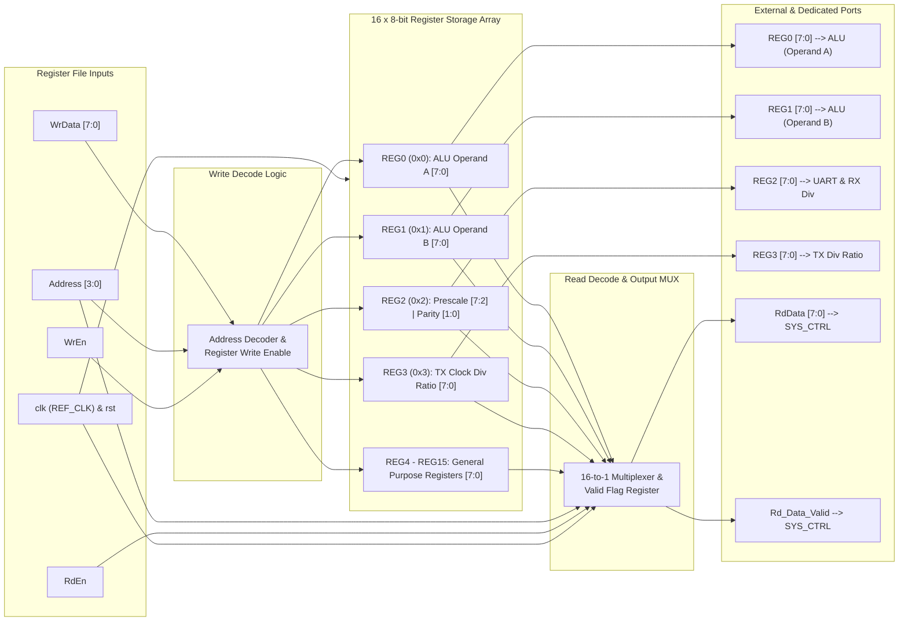

#### Memory Map & Reserved Registers:
| Address | Name | Default Value | Description |
| :---: | :---: | :---: | :--- |
| `0x0` | **REG0** | `8'h00` | **ALU Operand A**: Directly wired to the ALU A-input bus. |
| `0x1` | **REG1** | `8'h00` | **ALU Operand B**: Directly wired to the ALU B-input bus. |
| `0x2` | **REG2** | `8'h20` | **UART Configuration Register**:<br>&bull; `REG2[0]`: Parity Enable (`1` = enabled, `0` = disabled).<br>&bull; `REG2[1]`: Parity Type (`0` = Even, `1` = Odd).<br>&bull; `REG2[7:2]`: UART Prescale Ratio (default = `32`). |
| `0x3` | **REG3** | `8'h20` | **Clock Division Ratio**: Configures the integer divisor for `TX_CLK_DIV` (default = `32`). |
| `0x4 - 0xF` | **REG4 - REG15** | `8'h00` | **General Purpose Registers**: Available for normal host read/write operations. |

---

### 4.3 Arithmetic Logic Unit (`ALU`)
The **ALU** is a 16-bit parameterized computation engine operating on 8-bit operands (`A` and `B`). It executes arithmetic, logical, comparison, and shifting operations based on the 4-bit `ALU_FUN` signal.

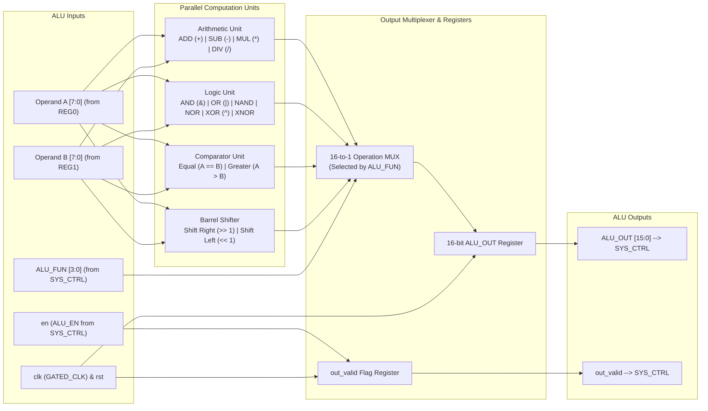

#### Supported ALU Operations:
| `ALU_FUN` | Operation | Output Formula / Logic | Description |
| :---: | :--- | :---: | :--- |
| `4'b0000` | **Addition** | `A + B` | 16-bit sum of operands |
| `4'b0001` | **Subtraction** | `A - B` | 16-bit difference of operands |
| `4'b0010` | **Multiplication**| `A * B` | 16-bit product of operands |
| `4'b0011` | **Division** | `A / B` | 16-bit quotient of operands |
| `4'b0100` | **Bitwise AND** | `A & B` | Bitwise logical AND |
| `4'b0101` | **Bitwise OR** | `A \| B` | Bitwise logical OR |
| `4'b0110` | **Bitwise NAND**| `~(A & B)` | Bitwise logical NAND |
| `4'b0111` | **Bitwise NOR** | `~(A \| B)` | Bitwise logical NOR |
| `4'b1000` | **Bitwise XOR** | `A ^ B` | Bitwise logical XOR |
| `4'b1001` | **Bitwise XNOR**| `~(A ^ B)` | Bitwise logical XNOR |
| `4'b1010` | **CMP: A = B** | `(A == B) ? 16'd1 : 16'd0` | Equality comparator |
| `4'b1011` | **CMP: A > B** | `(A > B) ? 16'd2 : 16'd0` | Greater-than comparator |
| `4'b1100` | **Shift Right** | `{1'b0, A[7:1]}` | Logical shift right by 1 bit |
| `4'b1101` | **Shift Left** | `{A[6:0], 1'b0}` | Logical shift left by 1 bit |

---

### 4.4 Integrated Clock Gating (`CLK_GATE`)
To reduce dynamic power consumption during idle periods, the ALU clock is gated using an **Integrated Clock Gating (ICG)** cell. The clock is active only when `SYS_CTRL` asserts `CLK_EN` during active ALU computations.

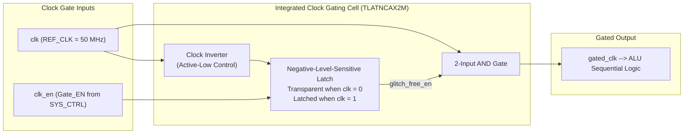

* **Architecture**: Negative-level-sensitive latch driving an AND gate, completely preventing clock glitches and runt pulses.
* **ASIC Implementation**: Maps to TSMC 130nm library cell `TLATNCAX2M`.

---

### 4.5 UART Transmitter (`UART_TX`)
The **UART Transmitter** handles parallel-to-serial conversion of bytes popped from the Asynchronous FIFO.

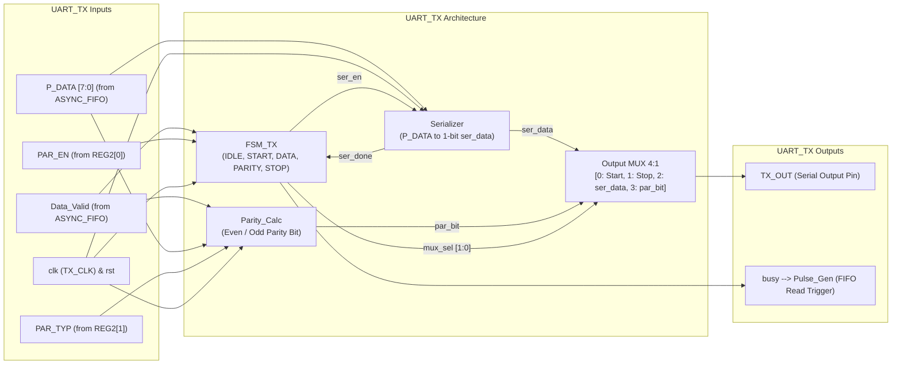

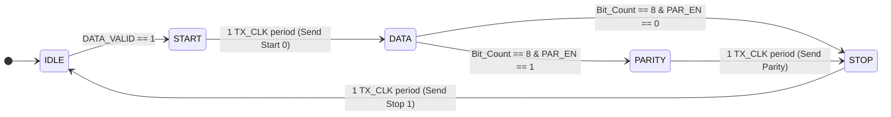

* **Internal Blocks**:
  * **`FSM_TX`**: Controls frame state sequencing (`IDLE`, `START`, `DATA`, `PARITY`, `STOP`).
  * **`Serializer`**: Shifts out parallel data bit-by-bit driven by `TX_CLK`.
  * **`Parity_Calc`**: Computes Even or Odd parity dynamically across the 8 data bits.
  * **`MUX`**: Multiplexes Start (`0`), Serial Data, Parity, and Stop (`1`) bits onto `TX_OUT`.
  * **`Busy` Flag**: Indicates when a transmission is ongoing; falling edge triggers next FIFO pop.

---

### 4.6 UART Receiver (`UART_RX`)
The **UART Receiver** captures incoming serial stream `RX_IN`, filters noise, checks frame integrity, and converts valid bytes into parallel data.

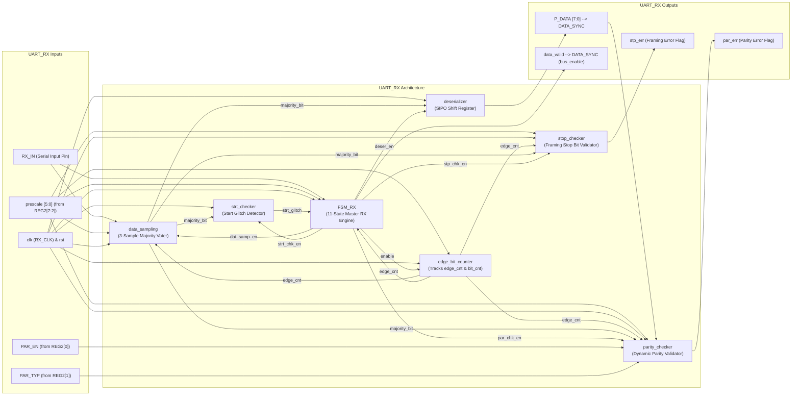

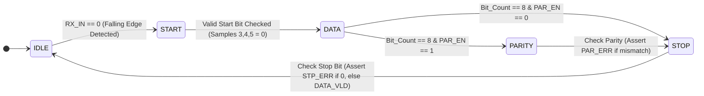

* **Internal Blocks**:
  * **`data_sampling`**: Takes 3 samples per bit interval and applies majority voting for glitch immunity.
  * **`strt_checker`**: Validates low-level start bit.
  * **`stop_checker`**: Verifies high-level stop bit; asserts `STP_ERR` if missing.
  * **`parity_checker`**: Verifies received parity bit; asserts `PAR_ERR` upon mismatch.
  * **`deserializer`**: Reconstructs serial bits into parallel 8-bit bus.
  * **`edge_bit_counter`**: Tracks oversampling edges and frame bit indices.
  * **`FSM_RX`**: Orchestrates reception and asserts `DATA_VLD`.

---

### 4.7 Asynchronous FIFO (`ASYNC_FIFO`)
The **Asynchronous FIFO** provides rate matching and safe cross-clock domain data transfer between the high-speed `REF_CLK` domain (writing ALU/RegFile results) and the low-speed `UART_CLK` domain (reading for serial transmission).

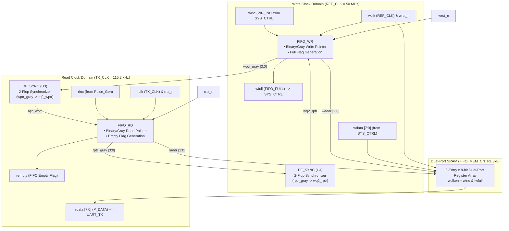

* **Buffer Depth & Width**: 8 words deep, 8 bits wide (dual-port memory).
* **Pointer Synchronization**: Read and Write pointers are converted to **Gray code** before crossing clock domains via 2-stage synchronizers (`DF_SYNC`), eliminating multi-bit metastability risks.
* **Full & Empty Logic**: Generated in the respective source domains to prevent data loss or underflow.

---

### 4.8 Multi-Bit Data Synchronizer (`DATA_SYNC`)
Transfers parallel 8-bit data from `UART_RX` (`UART_CLK` domain) into `SYS_CTRL` (`REF_CLK` domain) without bus skew or metastability issues.

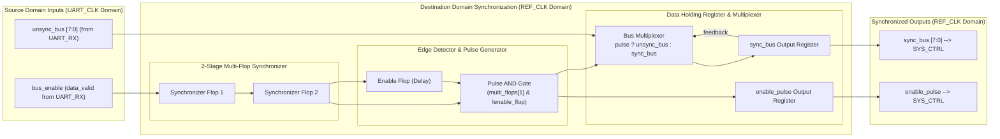

* **Mechanism**: Uses pulse handshake coordination. When `bus_enable` is asserted in the transmitter domain, a synchronized enable pulse is generated in the destination domain after the multi-bit bus has stabilized.

---

### 4.9 Reset Synchronizer (`RST_SYNC`)
Ensures clean system reset assertion and deassertion across both independent clock domains.

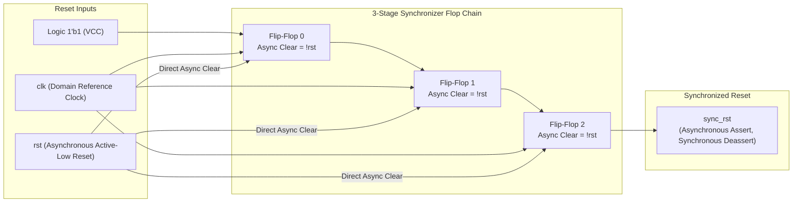

* **Operation**: **Asynchronous Assertion, Synchronous Deassertion**. Reset asserts instantly to protect hardware, but deasserts synchronously with clock edges to prevent reset recovery/removal timing violations.
* Two dedicated instances: `U0_RST_SYNC` for `REF_CLK` and `U1_RST_SYNC` for `UART_CLK`.

---

### 4.10 Clock Dividers & Prescaler MUX
Generates the baud clocks from `UART_CLK` (3.6864 MHz):
* **`U0_TX_CLK_DIV`**: Divides `UART_CLK` by `REG3` (division ratio) to produce `TX_CLK`.
* **`U1_RX_CLK_DIV`**: Divides `UART_CLK` by `rx_div_ratio` (produced by `prescale_mux` from `REG2[7:2]`) to generate the oversampled `RX_CLK`.

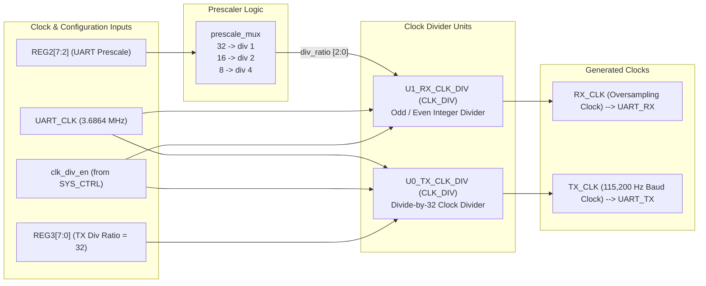

---

### 4.11 Pulse Generator (`Pulse_Gen`)
Detects the falling edge of the `UART_TX` busy signal and converts it into a single `TX_CLK`-cycle pulse. This pulse drives `R_INC` on the Asynchronous FIFO, popping the next byte for continuous multi-byte transmissions.

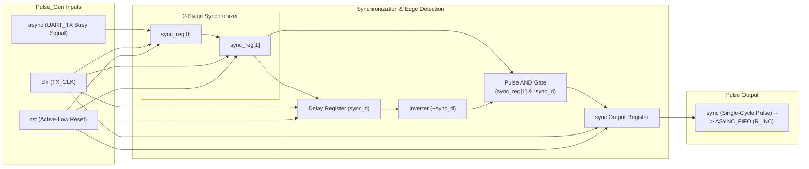

---

## 5. Verification & Waveforms

The design was fully verified using an exhaustive self-checking testbench ([`SYSTEM_TOP_tb.v`](Test_bench/SYSTEM_TOP_tb.v)) in **QuestaSim / ModelSim**, validating:
1. Reset assertion and deassertion across clock domains.
2. Register File configuration writes (`REG2` UART prescaler, `REG3` clock divisor).
3. General-purpose Register File writes and readback verification.
4. ALU operations with operands (Addition, Subtraction, Multiplication, Division, Logic).
5. ALU operations without operands (using cached operands).
6. Parity error detection and framing error reporting.
7. Asynchronous FIFO continuous buffering under rate mismatch.

### Simulation Waveform 1: Clocks, UART, Synchronization & Control
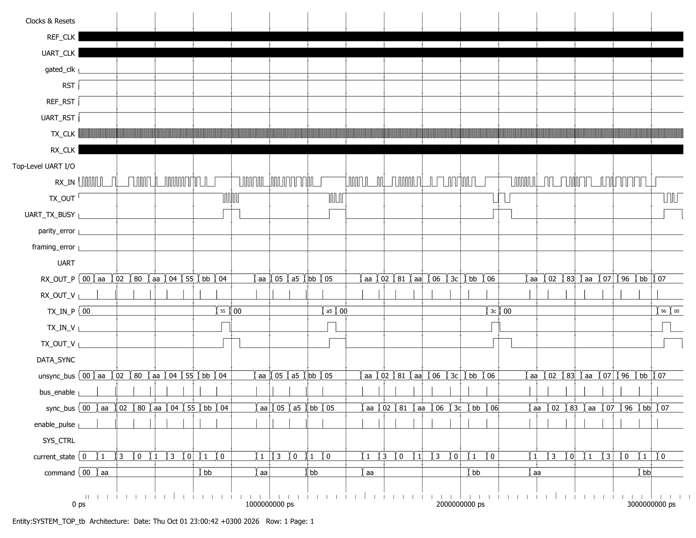

### Simulation Waveform 2: Register File & ALU Execution
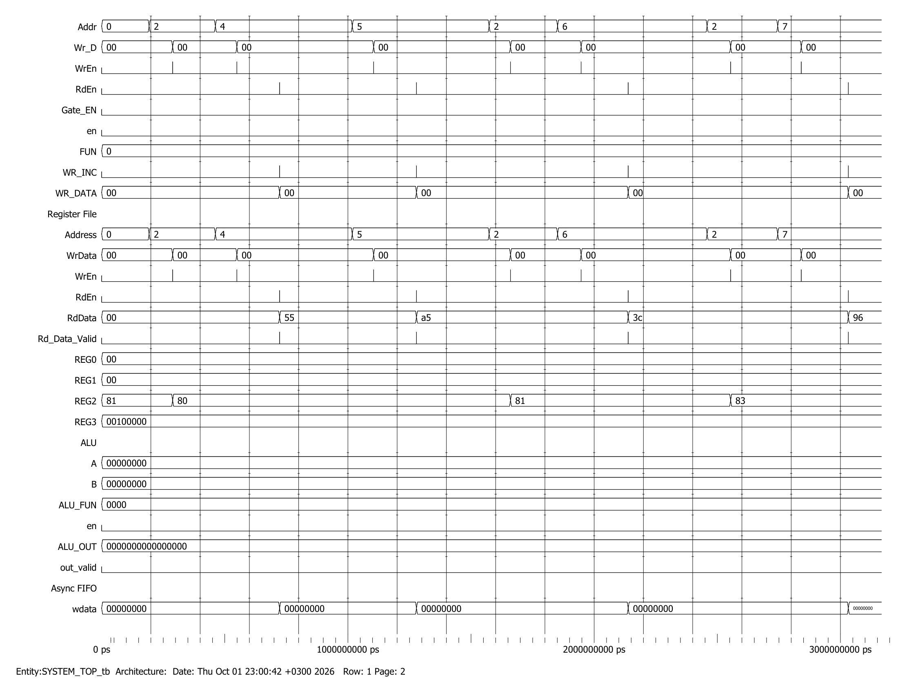

### Simulation Waveform 3: Asynchronous FIFO Buffering
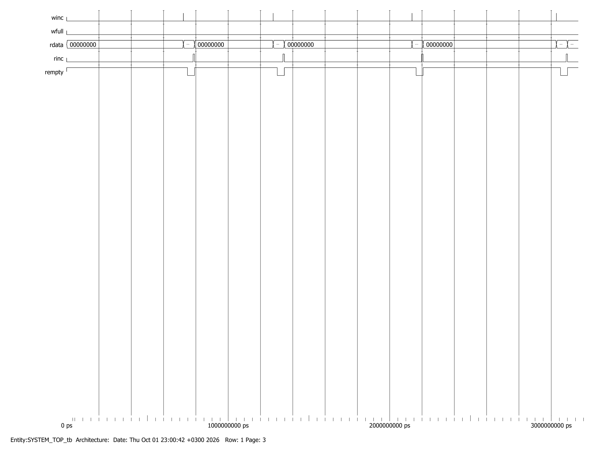

---

## 6. ASIC Implementation Flow & Results

The digital ASIC implementation flow was executed under worst-case corner conditions (**SS / 1.08V / 125°C**) using standard cell libraries (`scmetro_tsmc_cl013g_rvt`).

### 6.1 Logic Synthesis (Synopsys Design Compiler)
* **Target Clock Frequency**: 100 MHz (Clock Period = 10.0 ns)
* **Setup Timing Slack**: **`0.00 ns` (MET — Zero Slack Closure)**
* **Hold Timing Slack**: **`0.04 ns` (MET)**
* **Total Cell Area**: **`27,225.31 µm²`**
* **Total Chip Area (including net interconnect)**: **`301,113.36 µm²`**
* **Total Cell Count**: **2,275 cells** (1,844 combinational, 393 sequential)
* **Power Dissipation**: **13.56 mW Dynamic Power**, **704.9 nW Leakage Power**

```
Hierarchical Area Breakdown:
-------------------------------------------------------------
Hierarchical Cell     Absolute Area (um2)    Percent Total (%)
-------------------------------------------------------------
SYSTEM_TOP                27225.31                 100.0%
├── U0_ALU                 8864.08                  32.6%
├── U0_REGFILE             6045.88                  22.2%
├── U0_ASYNC_FIFO          4103.15                  15.1%
├── U0_UART                3730.14                  13.7%
├── U0_TX_CLK_DIV          1269.66                   4.7%
├── U1_RX_CLK_DIV          1269.66                   4.7%
├── U0_SYS_CTRL            1203.76                   4.4%
└── Synchronizers & Gate    738.98                   2.7%
-------------------------------------------------------------
```

### 6.2 Design for Testability (DFT Compiler)
* **Scan Architecture**: **4 Scan Chains** stitched across sequential elements.
* **Scan Cells**: 389 scan flip-flops.
* **Test Coverage**: **`99.66%`**
* **Fault Coverage**: **`99.27%`**
* **Fault Population**: 17,638 total faults evaluated; 0 un-testable violations.

### 6.3 Formal Verification (Synopsys Formality)
* **RTL vs. Post-Synthesis Netlist**: **100% Equivalence Verification SUCCEEDED** (55,620 compare points verified, 0 failing, 0 unverified).
* **Post-Synthesis vs. Post-DFT Netlist**: **100% Equivalence Verification SUCCEEDED** (53,410 compare points verified, 0 failing, 0 unverified).

### 6.4 Lint & CDC Sign-off (SpyGlass)
* **Lint Methodology**: Clean sign-off under `GuideWare/latest/block/rtl_handoff`.
* **Clock Domain Crossing (CDC)**: Structural and functional CDC verification passed across all domain crossings with customized waiver files.

---

## 7. Directory Structure

```
Final_System/
│
├── .github/
│   └── workflows/
│       └── ci.yml                      # Automated GitHub Actions RTL CI verification
│
├── docs/                               # System specifications and PDF documentation
│   ├── Final_System.pdf                # Architectural specifications
│   └── simulation_waveform.pdf         # Full formatted simulation waveform printout
│
├── do_files/                           # Multi-simulator automation & compilation scripts
│   ├── run.do                          # ModelSim / QuestaSim DO script
│   ├── wave.do                         # ModelSim waveform signal configuration & grouping
│   ├── run_iverilog.sh                 # Open-source Icarus Verilog script (Linux/macOS/CI)
│   └── run_iverilog.bat                # Open-source Icarus Verilog script (Windows)
│
├── IC/                                 # ASIC Implementation Flow (VM Environment)
│   └── Projects/
│       └── System/
│           ├── std_cells/              # TSMC 130nm library (.db and .lib files)
│           ├── lint/                   # SpyGlass Lint project, rules & waivers
│           ├── CDC/                    # SpyGlass CDC analysis, SDC & SGDC constraints
│           ├── Synthesis/              # Synopsys DC scripts, constraints, reports, netlists
│           ├── DFT/                    # Synopsys DFT scan insertion, scan netlists & reports
│           └── Formality/              # Formal Equivalence Verification (post-syn, post-dft, post-pnr)
│
├── rtl/                                # Golden synthesizable RTL source modules
│   ├── ALU/                            # 16-bit Arithmetic Logic Unit
│   │   └── ALU.v
│   ├── ASYNC_FIFO/                     # Dual-Clock Asynchronous FIFO
│   │   ├── ASYNC_FIFO.v
│   │   ├── DF_SYNC.v
│   │   ├── FIFO_MEM_CNTRL.v
│   │   ├── FIFO_RD.v
│   │   └── FIFO_WR.v
│   ├── CLK_DIV/                        # Parameterized Clock Divider
│   │   └── Clk_Div.v
│   ├── CLK_DIV_RX_MUX/                 # RX Oversampling Clock Prescale Multiplexer
│   │   └── prescale_mux.v
│   ├── CLK_GATING/                     # Integrated Clock Gating Cell (TLATNCA / Simulation)
│   │   └── CLK_GATE.v
│   ├── DATA_SYNC/                      # Multi-Bit Enable-Handshake Data Synchronizer
│   │   └── DATA_SYNC.v
│   ├── Pulse_Gen/                      # Single-Cycle Pulse Generator
│   │   └── Pulse_Gen.v
│   ├── Reg_File/                       # 16x8 Dual-Port Register File
│   │   └── regfile.v
│   ├── RST_SYNC/                       # 2-Stage Reset Synchronizer
│   │   └── RST_SYNC.v
│   ├── SYS_CTRL/                       # Master System Controller FSM
│   │   └── SYS_CTRL.v
│   ├── SYS_TOP/                        # Top-Level SoC Integration
│   │   └── SYSTEM_TOP.v
│   └── UART/                           # Full-Duplex Configurable UART Subsystem
│       ├── UART.v
│       ├── UART_TX.v
│       ├── UART_RX.v
│       ├── Serializer.v
│       ├── Parity_Calc.v
│       ├── MUX.v
│       ├── FSM_TX.sv
│       ├── FSM_RX.v
│       ├── data_sampling.v
│       ├── strt_checker.v
│       ├── stop_checker.v
│       ├── parity_checker.v
│       ├── edge_bit_counter.v
│       └── deserializer.v
│
├── Screenshots/                        # Logic simulation waveform captures
│   ├── modelsim_waveform_1.png
│   ├── modelsim_waveform_2.png
│   └── modelsim_waveform_3.png
│
├── scripts/                            # Host communication software & verification
│   └── uart_driver.py                  # Python UART host driver & protocol regression suite
│
├── Test_bench/                         # Exhaustive self-checking testbench
│   └── SYSTEM_TOP_tb.v
│
├── .gitignore                          # EDA & simulation cache filter
└── README.md                           # Master project documentation
```

---

## 8. How to Run Simulation & Verification

The testbench can be verified using proprietary EDA tools (ModelSim/QuestaSim), free open-source tools (Icarus Verilog + GTKWave), or interactively validated via the Python UART host driver:

### 8.1 ModelSim / QuestaSim (GUI Simulation)
1. Open **ModelSim / QuestaSim**.
2. Navigate to the `do_files` directory:
   ```tcl
   cd do_files
   ```
3. Run the automated compilation and execution script:
   ```tcl
   do run.do
   ```

### 8.2 Open-Source Simulation (Icarus Verilog & GTKWave)
The testbench can be compiled and executed with 100% open-source tools on Linux, macOS, or Windows:
* **Linux / macOS**:
  ```bash
  chmod +x do_files/run_iverilog.sh
  ./do_files/run_iverilog.sh
  ```
* **Windows (Command Prompt / PowerShell)**:
  ```bat
  do_files\run_iverilog.bat
  ```
* **View Simulation Waveforms in GTKWave**:
  ```bash
  gtkwave do_files/system_waveform.vcd
  ```

### 8.3 Host Python UART Driver & Interactive Verification
A Python driver is provided in `scripts/uart_driver.py` to interact with the SoC over a physical serial port or through the built-in mock hardware simulator:
* **Run the automated protocol regression suite**:
  ```bash
  python scripts/uart_driver.py --demo
  ```
* **Connect to a physical hardware UART / COM port**:
  ```bash
  python scripts/uart_driver.py --port COM3 --baud 115200
  ```

---

## Author
**Ahmed Badawy**  
Faculty of Engineering, Cairo University  
📧 `ahmed.badwy05@eng-st.cu.edu.eg`  
🔗 GitHub: [@ahmedbadwy77](https://github.com/ahmedbadwy77)
